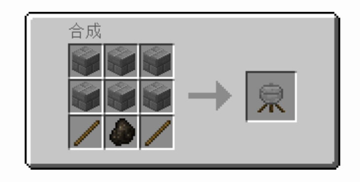

# mod服eoladv指北

eoladv为了使真实性和可玩性更强，利用mod加入了一些新的游戏机制，对新手来说有必要阅读以下内容以获取指引以完全体验到eoladv的游戏机制。但是即使你不阅读以下内容，你也能按照原版的方法游玩本服务器而几乎不受任何影响。

## 1.更多更强的boss

eoladv添加了灾变（L\_Ender 's Cataclysm）和Alex的洞穴（Alex's Caves），因此服务器内添加了多种更强大的boss、罕见的洞穴结构和多种多样的建筑结构，而且随着boss强度的增加，奖励也变得异常丰厚，绝对能成为你去挑战的理由和支撑你变得更加强大的一环！

### 灾变

灾变（L\_Ender 's Cataclysm）中的结构必须要自己去寻找，具体结构包含[远古工厂](https://www.mcmod.cn/item/707277.html)[沉没之城](https://www.mcmod.cn/item/707278.html)和[诅咒金字塔](https://www.mcmod.cn/item/785127.html)（主世界），[灵魂锻造厂](https://www.mcmod.cn/item/539016.html)和[烈焰竞技场](https://www.mcmod.cn/item/668331.html)（地狱）、[废弃堡垒](https://www.mcmod.cn/item/537457.html)（末地）。更多详细信息请阅读[mcmod页面](https://www.mcmod.cn/class/5214.html)。

### Alex的洞穴

而如果要寻找Alex的洞穴（Alex's Caves）中的洞穴结构，由于其过于稀有，几乎不可能通过自然的方式寻找到。所以，你需要先寻找在主世界内寻找地底小屋，它是唯一获取洞穴勘探台（能指向洞穴所在地）的方式。而定位地底小屋的地图可以从废弃矿井的箱子里开出，或者从制图师村民购买（不是每个都卖），地图会指向最近的未被发现的地底小屋。有时，流浪商人也会以8个绿宝石+1个指南针的价格贩卖一个地底小屋地图。更多详细信息请阅读[官方wiki](https://alexscaves.wiki.gg/)（英文）或本站的汉化wiki（计划中）。

## 2.新的冒险世界

eoladv添加了暮色森林（The Twilight Forest）和天境（The Aether）两个大名鼎鼎的冒险世界类mod，两个单独的世界有着奇异的地形，特殊的机制和强大的boss，更有独一无二的方块、武器和道具，但是难度也相当大。并且~~腐竹认为~~冒险世界应该是勇敢者的世界，所以两个冒险世界打开了死亡不掉落的选项（虽然你可以利用/back命令在死亡之后快速回到死亡地点），请谨慎探索！

### 暮色森林

要进入暮色森林世界，首先要建造暮色森林传送门。首先挖一个2x2，一格深的坑并填满水，周围以“自然”植物环绕（例如花、草、树苗或蘑菇）。搭建完成后，向水中丢出一粒钻石。若搭建正确，会有一道闪电划过并对附近玩家造成伤害~~（附近玩家：阿米诺斯）~~，此时水会变成有着下界传送门材质的暮色森林传送门。玩家需要直接跳入传送门中完成传送。 门激活完毕后，其周围的植物便可移除。

暮色森林大部分地区是祥和的生物群系，不仅是因为停止流动的时间，还因为其不会生成怪物的地表。然而，各种地标性建筑，以及其中可供挑战的更高难度的怪物和BOSS，仍是推动玩家在暮色森林中发展的主要动力。同时，伴随着高难度怪物而来的是更为丰厚的战利品。

暮色森林传送门的生成不受地形影响。也就是说，一扇新的传送门是有可能将玩家送入亡灵矿山内部或者某个BOSS所在地的，甚至有可能将玩家送到半空之中~~（服务器某管理员：阿米诺斯）~~。有鉴于此，玩家在第一次踏入暮色森林时，应做好充分的准备工作。

有关暮色森林的更多信息，请参见[中文wiki](https://ftb.fandom.com/wiki/Twilight\_Forest/zh-cn)

### 天境

要进入天境，你需要建造天境传送门。建造天境传送门的方法与建造地狱传送门的方法完全相反，你需要利用萤石来构建天境传送门框架（最小4×5，最大23×23），并用水来激活传送门。

当玩家第一次通过传送门来到天境时，你会获得一本天境传说，它在游戏中的功能类似于天境的百科全书。你可以阅读这本书，也可以通过将来自天境的物品放置于天境传说之上，来了解关于这个物品的信息。剩下的自然就是耐心且充满好奇的探索了。

仍然想获取有关天境的更多信息，请参见[官方wiki](https://aether.wiki.gg/wiki/Aether\_Wiki)（英文）。

## 3.新的武器工具系统

eoladv添加了tetra这一经典mod，使mc游戏中有了更具挑战性、扩展性且更强大的武器工具系统~~（腐竹觉得有一点点像那种rpg游戏的系统拿掉宝石）~~

要开始打造你自己的出色的武器，你首先要合成一个加工台，方法是用木锤右键一个已放置的工作台，就可以将工作台打造为加工台。木锤的合成如下图所示：

<figure><figcaption>
<strong>图中的木材换成任意的原木或是木板，都可以成功制造木锤</strong>
</figcaption></figure>

合成加工台之后，你会获得一个全息球（Holosphere），这个全息球相当于tetra的百科全书，请你好好珍惜！因为全息球的合成材料只能通过自然生成的锻造遗迹获取，而且这个遗迹非常非常难找。

然后，你就可以开始你的探索~~（瞎jb换武器里的东西）~~的旅程了，将武器放在加工台上，你会发现每一个部件都是可配置的，点开每个部件能看到很多可以进行的改装，比如淬火、变种啊balabala，每种改装都需要耗费一定的原材料，使用一定等级的工具（斧或锤）、并带来一定的效果。

<figure><figcaption>
<strong>鼠标放在红圈位置可以看到改装对武器带来的效果</strong>
</figcaption></figure>

<figure><figcaption>
<strong>鼠标放在蓝圈位置可以看到可以用来改造的材料</strong>
</figcaption></figure>

在身上持有全息球的情况下，点击蓝圈位置还能看到各材料改装之后武器的属性和需要使用的工具。

支持该系统的工具或武器有：刀剑、工具腰带、双头或单头工具、弓弩、盾牌。

怎么样，很简单吧！只要搜集好的材料，就一定会有好的武器属性！另外提醒一下，如果你想升级锤子，需要准备另一把锤子，因为工具不能自己升级自己。

另外还有两个很重要的参数，分别是界面中工具或武器的完整度、打磨值和附魔时工具的魔力容量（想要深入了解的可以看下去，一般来说知道以上的也已经够了w）。

完整度决定了你可以使用的零件数，有些零件会让完整度增加，而有些则会减小。当完整度被用完时，你将不能对这把工具或者武器在加工台上进行改造。多多使用武器或工具能增加完整度。

不仅如此，你的工具和武器还具有很强的成长潜力，当你使用它们时，打磨值会上升。而打磨值积累到一定程度时，工具或武器便可以进行强化。打磨能为工具带来攻击力，挖掘速度，耐久等提升，但这需要消耗完整度，而该工具的耐久与占用的完整度越多，打磨需要的打磨值也更多。

tetra也为工具或武器赋予了新的附魔机制。你可以正常的使用附魔台附魔，但也可以将带有附魔的附魔书在改造的附魔选项中给予对应部件。这会消耗工具或武器魔力容量，越高级的附魔消耗的越多，而这个值能达到负数。在魔力容量为负时，任何修改工具的行为都有可能导致闹鬼，这可能会使附魔失效 或者在使用该工具时生成一只拿着你的工具的恼鬼。虽然使用青金石与经验可以暂时祛除，但在以后你修复或修改时仍然可能闹鬼。

关于tetra的更多信息，可以参阅[mcmod页面](https://www.mcmod.cn/class/2018.html)

